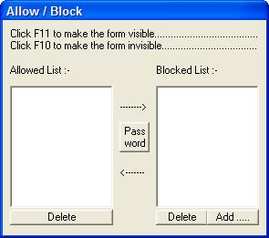



## Allow Block v2

### Description

Basiclly, for those who don't know this program, You can use it to Lock anyfile from being opened, deleted, renamed or even moved from its place. This new release has some new features. i tried to hide it as i can. I hope i succeeded. click F11 to show the main window or F10 to hide it again. This Version has an integration power to LockMe v5(coming soon).
 
### More Info
 

             |
---                |---
**Submitted On**   |2003-10-31 21:47:34
**By**             |[Haytham Alaa](https://github.com/Planet-Source-Code/PSCIndex/blob/master/ByAuthor/haytham-alaa.md)
**Level**          |Intermediate
**User Rating**    |4.3 (13 globes from 3 users)
**Compatibility**  |VB 6\.0
**Category**       |[Complete Applications](https://github.com/Planet-Source-Code/PSCIndex/blob/master/ByCategory/complete-applications__1-27.md)
**World**          |[Visual Basic](https://github.com/Planet-Source-Code/PSCIndex/blob/master/ByWorld/visual-basic.md)
**Archive File**   |[Allow\_Bloc1665761112003\.zip](https://github.com/Planet-Source-Code/haytham-alaa-allow-block-v2__1-49573/archive/master.zip)

